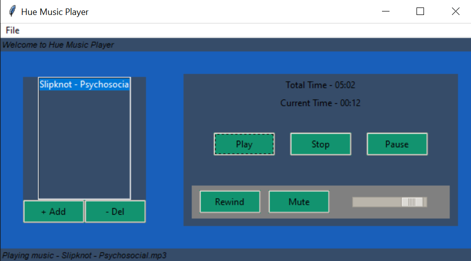

# Hue 🎶
A super cool music player built using Python and Tkinter 

# Features
- Add and Delete your favourite songs
- Play, Pause and Stop the song
- Rewind and mute at any time
- See the total time and current time of the song
- Change the volume! 🎉

# To Contribute 
- Fork the repository.
- Clone the repository using `git clone https://github.com/{yourUsername}/Hue.git`
- Install the dependencies using `pip install`.
- Run the `player.py` file 